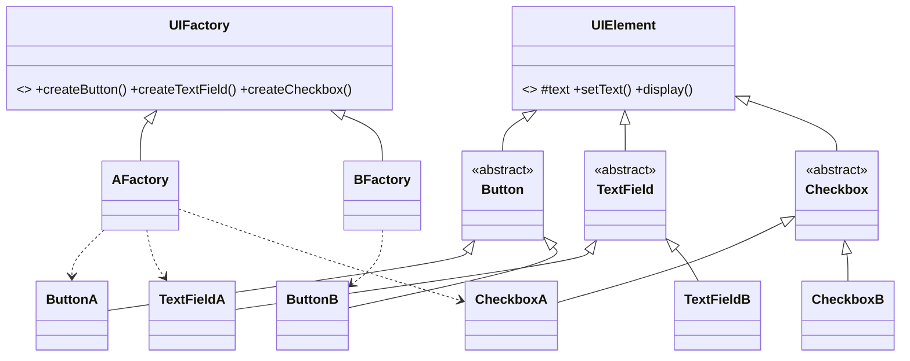

# 🛡️ Defensa — Assignment 02: Abstract Factory (ASCII UI)

> Guía para **entender** tu código y **defenderlo** ante el profesor.
> Curso: Suunnittelumallit · Patrón: **Abstract Factory** (familia **creacional**).

---

## 1. Tu explicación en una frase (el "pitch")

> **Abstract Factory crea familias completas de productos relacionados, garantizando que todos sean del mismo "estilo", sin que el cliente conozca las clases concretas.** Eliges **una** fábrica y de ella salen todos los elementos que combinan entre sí.

Si memorizas una sola idea: **"una fábrica, una familia de productos que combinan"**.

---

## 2. ¿Qué problema resuelve? (el "por qué existe")

Tienes elementos de UI (botón, campo de texto, checkbox) que deben verse todos en el **mismo estilo** (una familia "A" y otra "B"). El riesgo sin patrón: **mezclar** un botón estilo A con un checkbox estilo B → una interfaz inconsistente.

Abstract Factory resuelve dos cosas:
1. **Elegir la familia en una sola línea** (`new AFactory()` o `new BFactory()`).
2. **Garantizar la compatibilidad**: como todos los elementos salen de la **misma** fábrica, es **imposible** mezclar estilos por accidente.

Y añadir un estilo nuevo (familia C) = **crear una fábrica nueva**, sin tocar el cliente.

---

## 3. Los roles del patrón, mapeados a TU código

| Rol en el patrón (GoF) | Tu clase | Qué hace |
|---|---|---|
| **Abstract Factory** | `UIFactory` | Declara un método de creación por tipo de producto |
| **Concrete Factories** | `AFactory`, `BFactory` | Cada una produce **solo** su familia (A o B) |
| **Abstract Products** | `Button`, `TextField`, `Checkbox` | El "tipo" de producto, sin estilo concreto |
| **Concrete Products** | `ButtonA/ButtonB`, `TextFieldA/TextFieldB`, `CheckboxA/CheckboxB` | El elemento específico de cada familia |
| **Superclase común** | `UIElement` | Estado (`text`) y `setText()` compartidos por todos |
| **Client** | `Main` | Elige una fábrica y usa los productos por su tipo abstracto |

---

## 4. Explicación clase por clase (tu código)

### `UIElement` — la superclase común (aquí está el requisito 7)
```java
public abstract class UIElement {
    protected String text;                 // estado compartido por TODOS los elementos
    public UIElement(String text) { this.text = text; }
    public void setText(String text) { this.text = text; }   // definido UNA sola vez
    public abstract void display();        // cada elemento decide cómo se dibuja
}
```
El enunciado (requisito 7) pregunta **dónde** colocar `setText()`. Como es común a **todos** los elementos, se sube al **ancestro compartido**: se define **una sola vez** aquí, junto al campo `text`, y todos lo heredan. Eso es **DRY / alta cohesión**: no repites `setText` en cada clase. El cambio se ve en el **siguiente** `display()` porque `display()` siempre lee el valor actual de `text`.

### `UIFactory` — la Abstract Factory
```java
public abstract class UIFactory {
    public abstract Button    createButton(String text);
    public abstract TextField createTextField(String text);
    public abstract Checkbox  createCheckbox(String text);
}
```
Es el **contrato de la fábrica**: declara **un método de creación por cada tipo de producto**. Fíjate: son **tres "factory methods" dentro de una fábrica** — por eso se dice que Abstract Factory está "hecho de varios Factory Method".

### `AFactory` / `BFactory` — las Concrete Factories
```java
public class AFactory extends UIFactory {
    @Override public Button    createButton(String t)    { return new ButtonA(t); }
    @Override public TextField createTextField(String t) { return new TextFieldA(t); }
    @Override public Checkbox  createCheckbox(String t)  { return new CheckboxA(t); }
}
```
Cada una implementa la fábrica produciendo **solo su familia**: `AFactory` crea siempre elementos "A", `BFactory` siempre "B". **Nunca** se mezclan.

### `Button` / `TextField` / `Checkbox` — los Abstract Products
```java
public abstract class Button extends UIElement { public Button(String t){ super(t); } }
```
Definen el **tipo** de producto (un botón es un botón) pero **no** su apariencia. Heredan `text` y `setText()` de `UIElement`. Son abstractos porque el aspecto concreto lo ponen las variantes A/B.

### Las variantes concretas — `ButtonA`, `ButtonB`, … (Concrete Products)
Cada una implementa `display()` con su estilo ASCII. Ejemplo:
```java
public class ButtonA extends Button {   // estilo A: caja con + - |
    @Override public void display() {
        String content = " " + text + " ";
        String border  = "+" + "-".repeat(content.length()) + "+";
        System.out.println(border); System.out.println("|" + content + "|"); System.out.println(border);
    }
}
```
`ButtonB` usa asteriscos, `TextFieldA` corchetes con guiones bajos, `CheckboxA` `[X]`, etc. Son las piezas específicas de cada familia.

### `Main` — el Client
```java
UIFactory factory = new AFactory();   // <- cambia a new BFactory() para otro estilo
Button    button = factory.createButton("OK");
...
```
**Clave:** todas las variables son de **tipo abstracto** (`UIFactory`, `Button`, `TextField`, `Checkbox`). El cliente **nunca** nombra `ButtonA`/`ButtonB`. Por eso, cambiar `new AFactory()` por `new BFactory()` cambia **toda** la UI y es **imposible** mezclar estilos.

---

## 5. Las dos jerarquías paralelas (diagrama)



Hay **dos jerarquías**: la de **fábricas** (UIFactory → A/B) y la de **productos** (UIElement → Button/TextField/Checkbox → variantes A/B). La fábrica concreta "A" solo toca los productos "A".

---

## 6. La traza de ejecución (impresiona en la defensa)

```java
UIFactory factory = new AFactory();          // elijo la familia A
Button b = factory.createButton("OK");        // AFactory devuelve un ButtonA
b.display();                                  // ButtonA se dibuja con + - |
b.setText("CANCEL");                          // cambio el texto (heredado de UIElement)
b.display();                                  // se ve el nuevo texto en la caja
```

Con `AFactory`, `createButton` hace `return new ButtonA(text)`. El cliente lo guarda como `Button` (tipo abstracto) y llama `display()`; se ejecuta el `display()` de `ButtonA`. Al cambiar a `BFactory`, exactamente el mismo código del cliente produce los estilos "B".

**Salida verificada:**
```
=== Style A ===
+----+
| OK |
+----+
[ Name________ ]
[X] Accept terms

--- After button.setText("CANCEL") ---
+--------+
| CANCEL |
+--------+

=== Style B (same code, different factory) ===
******
* OK *
******
Name::::::::
(*) Accept terms
```

---

## 7. Decisiones de diseño (por si preguntan "¿por qué así?")

- **`setText()` en `UIElement`** (no en cada clase): es común a todos → se define una vez en el ancestro. DRY, alta cohesión. (Requisito 7.)
- **Los productos son clases abstractas, no interfaces**: porque comparten **estado** (`text`) e implementación (`setText`), y una interfaz no guarda estado. Una clase abstracta sí.
- **`UIFactory` es abstracta con 3 métodos**: un método de creación por tipo de producto; las concretas deciden la familia.
- **El cliente usa solo tipos abstractos**: para poder cambiar de familia en una línea y no acoplarse a `ButtonA`, etc.

---

## 8. Contexto: cómo se conecta con las otras tareas y temas

### Familia y lugar en el curso
Abstract Factory es **creacional** (se ocupa de **crear** objetos), como Factory Method (Asig. 01) y Singleton (Asig. 05). Se diferencia de los **estructurales** (Composite Asig. 03, Decorator Asig. 06) que **combinan** objetos ya creados.

### Factory Method (Asig. 01) vs Abstract Factory (Asig. 02) — ¡la comparación clave!
| | Factory Method (Asig. 01) | Abstract Factory (Asig. 02) |
|---|---|---|
| Qué crea | **Un** producto | **Una familia** de productos que combinan |
| Métodos de creación | Uno | Varios (uno por tipo de producto) |
| Mecanismo | Herencia (la subclase redefine el método) | Composición (el cliente usa un objeto fábrica) |
| Garantía extra | El tipo correcto de ese producto | Que **todos** sean de la **misma familia** |

Idea para soltar: **"un Abstract Factory está hecho de varios Factory Method"** — en tu código, `UIFactory` tiene tres métodos de creación, cada uno es un factory method.

### Conceptos de la Semana 1 que ilustra
- **Acoplamiento débil**: el cliente depende solo de `UIFactory`/`Button`/… (abstracciones).
- **Open/Closed**: agrego una familia "C" creando `CFactory` + variantes C, **sin tocar** el cliente ni las familias A/B.
- **Compatibilidad garantizada**: imposible mezclar estilos.

### Ejemplos reales (súbelos si puedes)
- **JPA / bases de datos**: `EntityManagerFactory` produce los objetos de acceso a datos según el SGBD (MariaDB, PostgreSQL…) — misma idea de "una fábrica por familia".
- **Toolkits de GUI** (Swing/AWT, o el ejemplo Motif/PM de las diapositivas): una fábrica por "look and feel".

---

## 9. 🎤 Banco de preguntas del profesor (con respuestas)

**P: ¿Qué es Abstract Factory y para qué sirve?**
R: Un patrón creacional para crear **familias de productos relacionados** sin que el cliente conozca las clases concretas, garantizando que todos los productos sean del mismo estilo.

**P: ¿En qué se diferencia de Factory Method?**
R: Factory Method crea **un** producto por herencia; Abstract Factory crea **una familia** por composición, con varios métodos de creación. De hecho, un Abstract Factory está hecho de varios Factory Method.

**P: ¿Dónde pusiste `setText()` y por qué? (requisito 7)**
R: En `UIElement`, la superclase común, junto al campo `text`. Es común a todos los elementos, así se define una sola vez (DRY) y todos lo heredan. El cambio se ve en el siguiente `display()`.

**P: ¿Por qué el cliente no menciona `ButtonA`/`ButtonB`?**
R: Para depender solo de las abstracciones. Así cambiar `new AFactory()` por `new BFactory()` cambia toda la UI y no se pueden mezclar estilos.

**P: ¿Cómo garantiza que no se mezclen estilos A y B?**
R: Porque todos los productos salen de la **misma** fábrica concreta; `AFactory` nunca crea un elemento "B".

**P: ¿Cómo agregarías un estilo C?**
R: Creo `CFactory extends UIFactory` con `ButtonC`, `TextFieldC`, `CheckboxC`. No modifico el cliente ni A/B → Open/Closed.

**P: ¿Por qué los productos son clases abstractas y no interfaces?**
R: Porque comparten estado (`text`) y la implementación de `setText()`; una interfaz no guarda estado, una clase abstracta sí.

**P: ¿A qué familia GoF pertenece?**
R: Creacional (como Factory Method, Singleton, Builder, Prototype).

**P: ¿Un ejemplo real?**
R: `EntityManagerFactory` de JPA (una fábrica por SGBD), o los toolkits de GUI con distintos "look and feel".

---

## 10. Compilar y ejecutar

```bash
javac *.java
java Main
```

---

## 11. Chuleta final (3 frases para memorizar)

1. **Abstract Factory = una fábrica que crea una familia completa de productos que combinan entre sí.**
2. El cliente usa solo tipos abstractos y elige la familia en una línea (`new AFactory()`), así que **no puede mezclar estilos**.
3. Está **hecho de varios Factory Method** (uno por tipo de producto); agregar una familia nueva es crear otra fábrica, sin tocar lo existente (**Open/Closed**).
