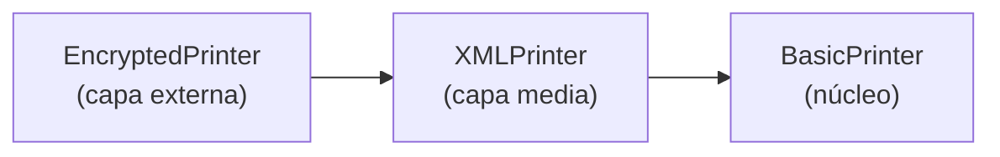

# 🛡️ Defensa — Assignment 06: Decorator (Customizable Printer)

> Guía para **entender** tu código y **defenderlo** ante el profesor.
> Curso: Suunnittelumallit · Patrón: **Decorator** (familia **estructural**).

---

## 1. Tu explicación en una frase (el "pitch")

> **El patrón Decorator permite añadir funcionalidades a un objeto envolviéndolo en "capas", en tiempo de ejecución, sin modificar su clase original ni crear una subclase por cada combinación.** Cada capa (decorador) implementa la misma interfaz que el objeto que envuelve: transforma o añade algo al mensaje y luego **delega** al objeto de adentro.

Si solo memorizas una idea, que sea esta: **"envolver para añadir comportamiento, y delegar hacia adentro"**.

---

## 2. ¿Qué problema resuelve? (el "por qué existe")

Imagina que quieres un printer que imprima: normal, cifrado, en XML, cifrado **y** XML, XML **y** cifrado… Si lo hicieras con **herencia**, necesitarías una subclase por cada combinación:

`EncryptedPrinter`, `XmlPrinter`, `EncryptedXmlPrinter`, `XmlEncryptedPrinter`, … → **explosión de subclases**. Inmanejable.

Con **Decorator**, cada comportamiento es un **decorador independiente** y los **apilas** en el orden y la cantidad que quieras, en runtime:

```java
new EncryptedPrinter(new XMLPrinter(new BasicPrinter()));   // cifra y luego envuelve en XML
```

Agregar un comportamiento nuevo = **agregar una clase**, no tocar las que ya existen.

---

## 3. Los roles del patrón, mapeados a TU código

| Rol en el patrón (GoF) | Tu clase | Qué hace |
|---|---|---|
| **Component** (interfaz) | `Printer` | El contrato común: todos saben `print(String)` |
| **Concrete Component** | `BasicPrinter` | El objeto base real; imprime a consola |
| **Decorator** (base, abstracto) | `PrinterDecorator` | Implementa `Printer` **y** guarda un `Printer` envuelto |
| **Concrete Decorators** | `EncryptedPrinter`, `XMLPrinter` | Transforman el mensaje y delegan |
| **Client** | `Main` | Arma las combinaciones y llama `print(...)` |

---

## 4. Explicación clase por clase (tu código)

### `Printer` — el Component (la interfaz)
```java
public interface Printer {
    void print(String message);
}
```
Es el **contrato**. Todo lo que "sea un Printer" — el básico y los decoradores — promete tener `print(String)`. Gracias a esto, el cliente puede tratar a **cualquier** printer (simple o decorado) exactamente igual. Es la clave del **acoplamiento débil**: todo depende de esta abstracción, no de clases concretas.

### `BasicPrinter` — el Concrete Component
```java
public class BasicPrinter implements Printer {
    @Override public void print(String message) {
        System.out.println(message);
    }
}
```
Es el objeto **real** que hace el trabajo base: imprimir a la consola. **No sabe nada** de cifrado ni de XML. Los decoradores le añadirán eso por fuera. Siempre está **al fondo** de la pila (es quien finalmente imprime).

### `PrinterDecorator` — el Decorator base (¡la pieza clave!)
```java
public abstract class PrinterDecorator implements Printer {
    protected final Printer wrapped;      // el printer que se está decorando
    protected PrinterDecorator(Printer wrapped) {
        this.wrapped = wrapped;
    }
}
```
Aquí está el corazón del patrón: esta clase tiene una **doble relación** con `Printer`:

- **ES un `Printer`** (`implements Printer`) → por eso un decorador puede ir donde se espera un `Printer` (incluso dentro de otro decorador).
- **TIENE un `Printer`** (`protected final Printer wrapped`) → guarda una referencia al objeto que envuelve, para **delegarle**.

Esa combinación **"is-a + has-a"** (soy un Printer y contengo un Printer) es lo que permite **encadenar** capas. Es **abstracta** porque un "decorador genérico" no tiene sentido por sí solo: solo sirven sus versiones concretas (Encrypted, XML).

### `EncryptedPrinter` — Concrete Decorator (cifra)
```java
@Override public void print(String message) {
    wrapped.print(encrypt(message));   // 1) cifra  2) delega al de adentro
}
```
Añade comportamiento **antes** de delegar: **cifra** el mensaje (cifrado César, corre cada letra +3: H→K, e→h…) y luego llama a `wrapped.print(...)` con el texto ya cifrado. El cifrado es **reversible** (se descifra corriendo −3), que es lo único que pedía el enunciado ("decryptable").

### `XMLPrinter` — Concrete Decorator (envuelve en XML)
```java
@Override public void print(String message) {
    wrapped.print("<message>" + message + "</message>");
}
```
Añade las etiquetas `<message>…</message>` alrededor del texto y delega al de adentro.

### `Main` — el Client
```java
Printer printer = new BasicPrinter();
printer.print("Hello World!");                                    // Hello World!

Printer printer2 = new EncryptedPrinter(new XMLPrinter(new BasicPrinter()));
printer2.print("Hello World!");                                   // <message>Khoor Zruog!</message>
```
Nota que las dos variables son de tipo **`Printer`** (la interfaz), no de las clases concretas: el cliente **no distingue** si es un printer simple o uno de tres capas. Esa uniformidad es el objetivo.

---

## 5. La traza de ejecución (esto impresiona en la defensa)

`new EncryptedPrinter(new XMLPrinter(new BasicPrinter()))` construye esta **cebolla** (capas de afuera hacia adentro):



Cuando llamas `print("Hello World!")`, el mensaje **viaja hacia adentro** transformándose:

1. `EncryptedPrinter.print("Hello World!")` → cifra → `"Khoor Zruog!"` → llama a `XMLPrinter.print("Khoor Zruog!")`
2. `XMLPrinter.print("Khoor Zruog!")` → envuelve → `"<message>Khoor Zruog!</message>"` → llama a `BasicPrinter.print(...)`
3. `BasicPrinter.print("<message>Khoor Zruog!</message>")` → **imprime** en consola.

**Salida:** `<message>Khoor Zruog!</message>`

### ⚠️ El orden importa (pregunta típica del profe)
Si lo armaras al revés, `new XMLPrinter(new EncryptedPrinter(new BasicPrinter()))`:
1. XML envuelve primero → `<message>Hello World!</message>`
2. Encrypted cifra **todo, incluidas las etiquetas** → `<message>` se convierte en algo como `<phvvdjh>…`

→ resultado **distinto**. Moraleja: cada capa opera sobre el resultado de la de afuera; el **orden de anidamiento define el orden de las transformaciones**.

---

## 6. Decisiones de diseño (por si te preguntan "¿por qué así?")

- **`Printer` es interfaz** (no clase abstracta): solo define el contrato, no hay estado ni código que compartir. Da acoplamiento débil y una API limpia.
- **`PrinterDecorator` es abstracta**: no tiene sentido instanciar un "decorador genérico"; solo sus concretos. Centraliza el campo `wrapped` para no repetirlo en cada decorador.
- **`wrapped` es `protected final`**: `final` porque la capa que envuelves no cambia durante la vida del objeto; `protected` para que las subclases (los decoradores concretos) puedan delegarle.
- **Cifrado César**: simple y **reversible**, que es lo que pedía el enunciado. En un sistema real usarías algo fuerte (AES); aquí el foco es el **patrón**, no la criptografía.
- **Cifrar antes de delegar**: el decorador hace su parte y luego pasa el resultado hacia adentro; así se encadenan las transformaciones.

---

## 7. Contexto: cómo se conecta con las otras tareas y temas

### Familia y lugar en el curso
Decorator es un patrón **estructural** (organiza/combina objetos ya creados), igual que **Composite** (Asig. 03), Adapter, Proxy, Facade, Bridge, Flyweight. Se diferencia de los **creacionales** (Factory Method, Abstract Factory, Singleton — Asig. 01, 02, 05) que se ocupan de **crear** objetos, no de combinarlos.

### Conceptos de la Semana 1 que ilustra
- **Composición sobre herencia**: añade comportamiento **envolviendo** (composición) en vez de **heredar** — más flexible y en runtime.
- **Open/Closed Principle**: para un comportamiento nuevo (p. ej. comprimir) **agregas** una clase `CompressedPrinter extends PrinterDecorator`, sin **modificar** `BasicPrinter` ni los demás. Abierto a extensión, cerrado a modificación.
- **Acoplamiento débil**: todo depende de la interfaz `Printer`, no de clases concretas.
- **Single Responsibility**: cada decorador hace **una** cosa (cifrar / XML).

### Decorator vs. Herencia
Con herencia, las combinaciones se fijan **en compilación** y explotan en subclases. Con Decorator las combinas **en ejecución**, en cualquier orden y número.

### Decorator vs. Composite (Asig. 03) — se parecen, ¡ojo!
Ambos usan la misma "forma": un objeto que **contiene otro del mismo tipo** y **delega recursivamente**. La diferencia es el **propósito**:
- **Composite** = estructura de **árbol** (un nodo tiene **muchos** hijos); sirve para tratar igual a un elemento y a un grupo. `Department` contenía **una lista** de componentes.
- **Decorator** = **cadena lineal** (cada capa envuelve a **uno** solo); sirve para **añadir comportamiento**, no para formar estructuras. `PrinterDecorator` envuelve **un** `wrapped`.

### Ejemplo real famoso (súbelo si puedes)
La biblioteca **`java.io`** es Decorator puro:
```java
BufferedReader br = new BufferedReader(new FileReader("archivo.txt"));
```
`BufferedReader` **decora** a `FileReader` añadiéndole buffering — exactamente tu patrón. Mencionarlo demuestra que entiendes el patrón más allá del ejercicio.

---

## 8. 🎤 Banco de preguntas del profesor (con respuestas)

**P: ¿Qué es el patrón Decorator y para qué sirve?**
R: Un patrón estructural para **añadir responsabilidades a un objeto dinámicamente**, envolviéndolo en decoradores que comparten su interfaz. Sirve para combinar comportamientos sin crear una subclase por combinación.

**P: ¿Por qué no usaste herencia?**
R: Porque las combinaciones (cifrado, XML, cifrado+XML…) provocarían una explosión de subclases y quedarían fijas en compilación. Con Decorator las apilo en runtime, en cualquier orden.

**P: ¿Cuál es la clase clave y por qué?**
R: `PrinterDecorator`: **implementa** `Printer` (es-un) **y guarda** un `Printer` (tiene-un). Esa doble relación permite encadenar capas y que el cliente las trate igual que a un printer simple.

**P: ¿Qué pasa si cambias el orden de los decoradores?**
R: Cambia el resultado. `Encrypted(XML(Basic))` cifra primero y luego envuelve en XML; al revés, XML envuelve primero y el cifrado afectaría también a las etiquetas. Cada capa transforma la salida de la anterior.

**P: ¿Cómo añadirías un tercer comportamiento, por ejemplo comprimir?**
R: Creo `class CompressedPrinter extends PrinterDecorator`, implemento `print()` comprimiendo y delegando, y lo apilo. No modifico ninguna clase existente → Open/Closed.

**P: ¿Por qué `PrinterDecorator` es abstracta?**
R: Porque un decorador "genérico" no aporta comportamiento; solo sirven los concretos. Además centraliza el campo `wrapped` para reutilizarlo.

**P: ¿Tu cifrado es seguro?**
R: No, es un César (trivial de romper). El enunciado solo pedía que fuera **descifrable**; el objetivo es demostrar el **patrón**, no la criptografía. En producción usaría AES.

**P: ¿A qué familia GoF pertenece y qué otros conoces de ella?**
R: **Estructural**. Otros: Composite, Adapter, Proxy, Facade, Bridge, Flyweight.

**P: ¿Diferencia con Composite?**
R: Misma forma (contiene otro del mismo tipo + recursión), distinto fin: Composite arma **árboles** (muchos hijos) para tratar parte y todo igual; Decorator arma **cadenas** (un envuelto) para **añadir comportamiento**.

**P: ¿Qué principio SOLID ilustra?**
R: Sobre todo **Open/Closed** (agrego decoradores sin tocar los existentes) y **SRP** (cada decorador, una responsabilidad).

**P: ¿Un ejemplo real en Java?**
R: `java.io`: `new BufferedReader(new FileReader(...))` — BufferedReader decora a FileReader.

---

## 9. Compilar y ejecutar

```bash
javac *.java
java Main
```
Salida:
```
Hello World!
<message>Khoor Zruog!</message>
```

---

## 10. Chuleta final (3 frases para memorizar)

1. **Decorator = envolver un objeto en capas que comparten su interfaz, para añadir comportamiento sin herencia.**
2. La clase base del decorador **es-un** `Printer` y **tiene-un** `Printer`: por eso se encadenan y el cliente las trata igual.
3. Cada capa **transforma y delega hacia adentro**; el **orden** de anidamiento define el orden de las transformaciones.
